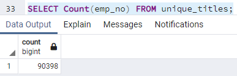
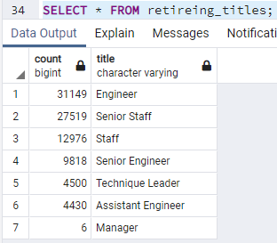
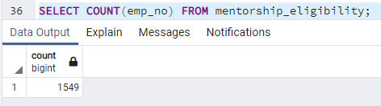
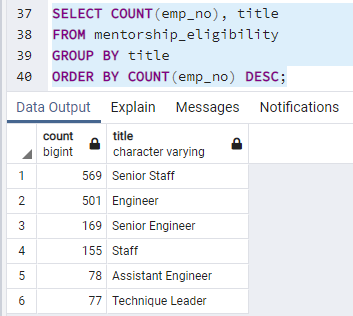

# Pewlett Hackard Analysis

## Overview

### Purpose
I am to determine the number of retiring employees per title and to adentify which employees are eligible to participate in a mentorship program and see if the company is perepared for the "silver tsunami" that is about to happen soon.

## Results
- Total Retiring Employees  

- Retiring Employees based on Titles  

- Total Employees Eligible for the Mentorship Program  

- Employees Eligible for Mentorship program based on Titles  

# Summary
